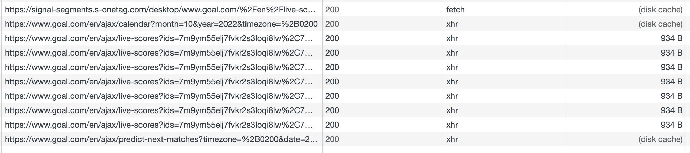

# Peak loadings

### Static pages

- home 
- leagues and teams' data
- lifestyle
- buyer's guide
- contact us 
- terms and policies page

Mostly static cached content. 

- News (/news/) and news sections (transfers, opinions etc.). 

Mostly static content. There can be peak loading in case of publishing some sensations and breaking news that can be extremely popular. 

Publishing news is predictable so the resources can be scaled for the news-related geolocation. Using CDNs to cache content will help. 

### Scores (/live-scores)

Mostly cached data except the live scores data that is collected through the ajax calls every 30s. The scores page itself may not generate peak loading. The high traffic is more expected on the match page.  

### Match (/match/*)

Page contains a lot of live data like: 
current score, stats and events

heatmap and positions

That data is retrieved through the ajax calls every 30s

Page may generate peak loading caused by the **concurrent resource usage** during the matches. Peak loading is predictable so the resources can be scaled for match-related geolocation. The more global match is - the more resources may be required. Also, short-term caching of the live-data will help. 

### Other

Website doesn't have a push notifications enabled. 

Scheduled tasks, ddos attacks and bots activity can still cause peak loading. 
